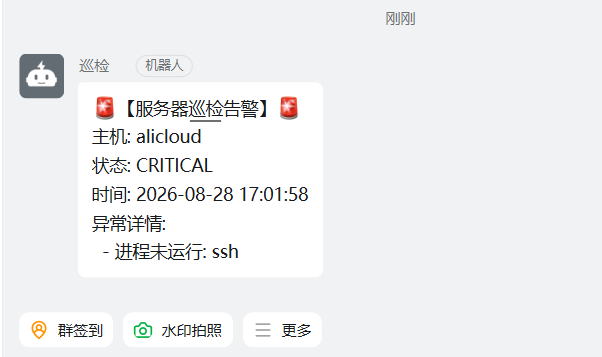

# Ops-HealthCheck: 轻量化无 Agent 巡检系统

本项目是一个基于 Shell 编写的自动化运维工具，通过 SSH 协议实现对多台远程服务器的健康状态监测。巡检结果按主机归档保存到本地日志，并可在指标超过阈值时通过 Webhook 发送告警。

---

## 📂 目录结构

```text
Linux-Server-Health-Check/
├── bin/
│   └── healthcheck.sh            # 主执行程序 (需具备执行权限)
├── conf/
│   ├── hosts.conf.example        # 主机清单示例
│   ├── hosts.conf                # 巡检主机清单 (IP 或 Hostname)
│   ├── webhook.conf.example      # Webhook 配置示例
│   └── webhook.conf              # Webhook 告警地址
├── logs/
│   └── <hostname>/               # 自动生成的按主机归档的日志
└── README.md                     # 项目文档
```

---

## 🛠️ 快速开始

### 1. 准备工作

* **SSH 密钥认证**：控制节点需要能够通过 SSH 密钥认证登录目标主机。
* **依赖工具**：控制节点需安装 `curl`（用于发送 Webhook 告警，不启用告警时可省略）。

### 2. 配置主机列表

配置文件不随仓库分发，需从示例文件复制生成：

```bash
cp conf/hosts.conf.example conf/hosts.conf
```

编辑 `conf/hosts.conf`，每行填入一个目标 IP 或主机名：

```text
192.168.1.10
192.168.1.11
server-node-01
```

### 3. 配置告警（可选）

创建 webhook 配置文件：

```bash
cp conf/webhook.conf.example conf/webhook.conf
```

在 `conf/webhook.conf` 中填入 Webhook 链接：

```text
https://oapi.dingtalk.com/robot/send?access_token=YOUR_TOKEN
```

### 4. 运行巡检

```bash
# 1. 赋予执行权限
chmod +x bin/healthcheck.sh

# 2. 手动测试运行
./bin/healthcheck.sh
```

建议先手动运行，确认 SSH 连接、日志输出与告警推送均正常后再配置定时任务。

### 5. 部署自动化 (Cron)

通过 `crontab -e` 设置每 5 分钟自动执行一次：

```bash
*/5 * * * * /path/to/Linux-Server-Health-Check/bin/healthcheck.sh >/dev/null 2>&1
```

请将 `/path/to/Linux-Server-Health-Check` 替换为项目的实际绝对路径，并使用 `crontab -l` 确认配置已生效。

---

## 📊 巡检指标说明

| 指标 | 监控逻辑 | 警告阈值 | 严重阈值 |
| :--- | :--- | :--- | :--- |
| **主机状态** | SSH 联通性测试 | - | - |
| **CPU 负载** | 1min 平均负载 / 核数 | 0.7 | 1.0 |
| **磁盘空间** | 根目录 `/` 使用率 | 80% | 90% |

CPU 负载采用归一化计算方式。例如 4 核服务器的 1 分钟平均负载为 `3.2`，则归一化结果为 `3.2 / 4 = 0.8`，触发警告级别告警。

### 自定义阈值

阈值定义在 `bin/healthcheck.sh` 顶部的变量中，直接编辑对应变量即可生效：

```bash
vim bin/healthcheck.sh
```

---

## 告警效果
磁盘使用率超过阈值时，钉钉机器人收到的告警：


---

## 🔒 安全建议

* 使用专用的低权限账号执行远程巡检。
* 限制配置文件与 SSH 私钥的访问权限。
* Webhook 链接包含访问令牌，请注意保管，避免泄露。
